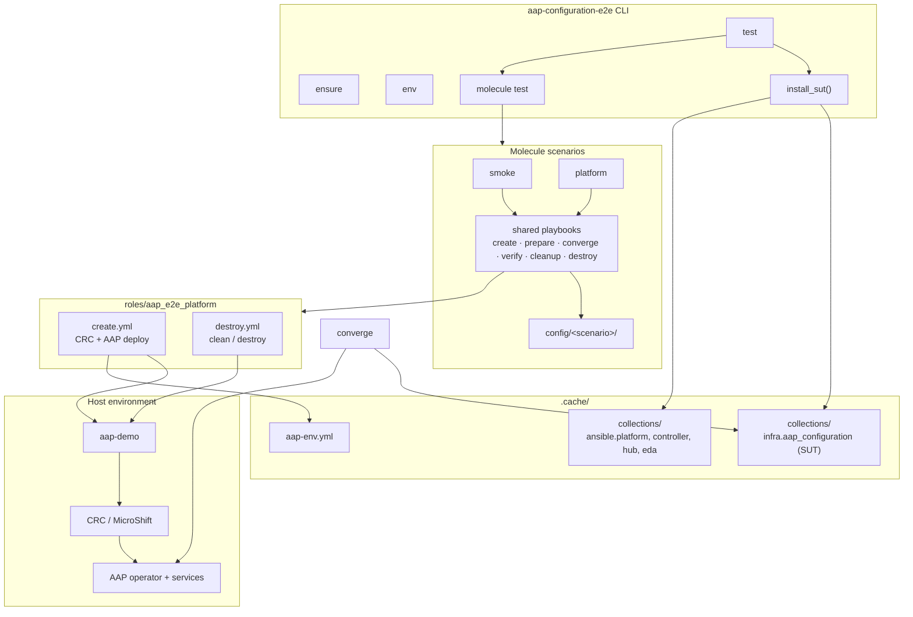
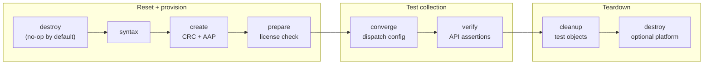
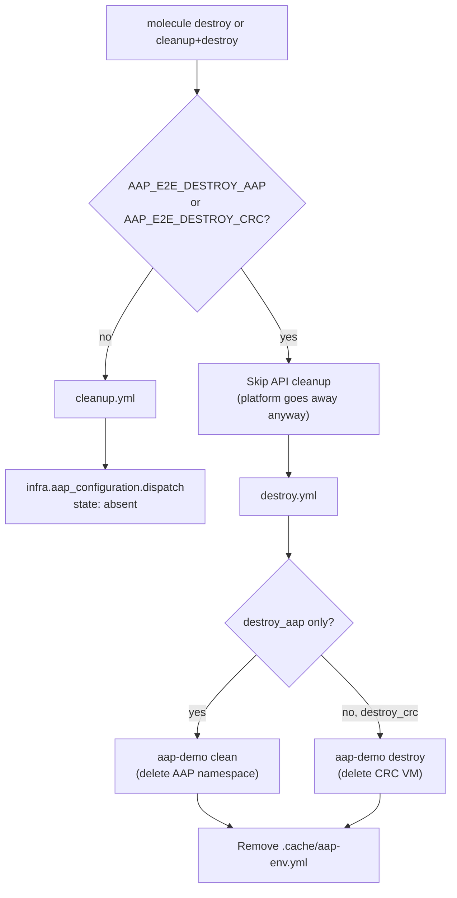
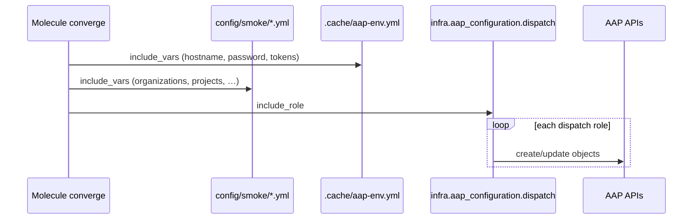

# Architecture

This document explains how **aap-configuration-e2e** works, where responsibilities live, and how to test arbitrary versions of `infra.aap_configuration`.

## Purpose

The harness answers one question:

> Does this version of `infra.aap_configuration` correctly configure a real AAP instance?

It is **not** part of the collection. It is a separate project that:

1. Installs a **system under test (SUT)** — any checkout, branch, or PR of the collection.
2. Provisions (or reuses) a local AAP on CRC via [aap-demo](https://github.com/RedHatOfficial/aap-demo).
3. Runs **Molecule** scenarios that apply config through `infra.aap_configuration.dispatch` and verify the APIs.

That separation is intentional: contributors can work on the collection without CRC, while maintainers and CI can gate changes against a live platform.

## Component overview



| Piece | Location | Role |
|-------|----------|------|
| **CLI** | `src/aap_configuration_e2e/` | Resolve SUT source, install collections, invoke Molecule |
| **Molecule** | `molecule/` | Scenario orchestration and shared playbooks |
| **Config** | `config/<scenario>/` | Vars fed to `infra.aap_configuration.dispatch` |
| **Platform role** | `roles/aap_e2e_platform/` | CRC/AAP lifecycle via `aap-demo` |
| **Certified deps** | `collections/requirements.yml` | `ansible.platform`, `ansible.controller`, etc. |
| **SUT** | `.cache/collections/.../infra/aap_configuration` | Whatever you asked to test (built per run) |

## Testing a collection version (the main workflow)

The CLI `test` command always does two things in order:

```text
install_sut(...)  →  molecule test -s <scenario>
```

`install_sut` writes certified dependencies and the collection under test into `.cache/collections`. Molecule then uses `ANSIBLE_COLLECTIONS_PATH` pointing at that directory, so **every converge/verify/cleanup run uses the version you just installed**.

### Source options (mutually exclusive)

| Flag | What gets installed | Typical use |
|------|---------------------|-------------|
| `--path /path/to/infra.aap_configuration` | `ansible-galaxy collection build` from local checkout | Active development on your machine |
| `--pr 123` | `gh pr view` → fork + branch → `ansible-galaxy collection install git+https://...` | Review a GitHub PR |
| `--repo owner/repo --ref branch` | `ansible-galaxy collection install git+https://github.com/owner/repo.git,branch` | Test `devel`, a release tag, or a fork branch |
| *(none)* | Same as `--path` if `~/workspace/forks/infra.aap_configuration` exists; else `--repo redhat-cop/infra.aap_configuration --ref devel` | Convenience default |

### Examples

```bash
# Local checkout (most common while developing)
.venv/bin/python -m aap_configuration_e2e test \
  --path ~/workspace/forks/infra.aap_configuration

# GitHub PR (needs `gh` authenticated)
.venv/bin/python -m aap_configuration_e2e test --pr 456

# Upstream branch
.venv/bin/python -m aap_configuration_e2e test \
  --repo redhat-cop/infra.aap_configuration --ref devel

# Fork branch
.venv/bin/python -m aap_configuration_e2e test \
  --repo myuser/infra.aap_configuration --ref feature/hub-sync

# Deeper scenario, reuse already-running CRC+AAP
.venv/bin/python -m aap_configuration_e2e test \
  --path ~/workspace/forks/infra.aap_configuration \
  --scenario platform --skip-provision

# Makefile wrapper (installs collection from COLLECTION_PATH, then molecule)
make test-smoke COLLECTION_PATH=~/workspace/forks/infra.aap_configuration
```

`make test-smoke` / `make test-platform` call the same CLI with `--path $(COLLECTION_PATH)`.

### What `--skip-provision` does

Sets `AAP_E2E_SKIP_PROVISION=1` for Molecule **create** only. CRC/AAP are not started or redeployed; create exports connection vars from the running cluster into `.cache/aap-env.yml`. Use this when the platform is already up and you only want to re-test collection changes.

## Molecule lifecycle (detailed)

`molecule test` runs this sequence (see `molecule/smoke/molecule.yml`):

```text
destroy → syntax → create → prepare → converge → verify → cleanup → destroy
```



### Phase responsibilities

| Phase | Playbook | Does |
|-------|----------|------|
| **destroy** (start) | `shared/destroy.yml` | Clears Molecule “already created” state. With default env vars, **no-op** for CRC/AAP. |
| **create** | `shared/create.yml` → `aap_e2e_platform/create.yml` | Start/create CRC, deploy/heal AAP, write `.cache/aap-env.yml`. |
| **prepare** | `shared/prepare.yml` | Assert env file; apply AAP subscription manifest if Controller is unlicensed. |
| **converge** | `shared/converge.yml` | Load `config/<scenario>/`, run `infra.aap_configuration.dispatch` with `state: present`. |
| **verify** | `shared/verify.yml` | HTTP checks against gateway/controller/hub/eda APIs. |
| **cleanup** | `shared/cleanup.yml` | Remove test objects via dispatch with `state: absent` (org `aap-config-e2e`). |
| **destroy** (end) | `shared/destroy.yml` | Optional CRC/AAP teardown when `AAP_E2E_DESTROY_*` is set. |

The leading **destroy** exists so **create always runs** on `molecule test`, even if a previous run left Molecule state behind. It does not tear down CRC/AAP unless you opt in.

### Cleanup vs destroy (platform teardown)

These are different concerns:

| Action | Removes | When |
|--------|---------|------|
| **cleanup** | Test objects in AAP (org, projects, hub namespace, …) | End of every `molecule test`; also `make cleanup` |
| **destroy** | AAP operator namespace and/or CRC VM | Only when `AAP_E2E_DESTROY_AAP` / `AAP_E2E_DESTROY_CRC` is `true` |



**Why cleanup is skipped during platform destroy**

Molecule always runs **cleanup before destroy**. When you call `make destroy-all`, AAP APIs may already be unreachable (AAP stopped or CRC down). Cleanup now exits immediately when either destroy flag is set, and **destroy** removes the platform instead:

- **`make destroy-aap`** (`AAP_E2E_DESTROY_AAP=true` only): `aap-demo clean` — deletes the AAP operator namespace; CRC stays up.
- **`make destroy-crc`** (`AAP_E2E_DESTROY_CRC=true` only): `aap-demo destroy` — deletes the CRC VM (AAP goes with it).
- **`make destroy-all`** (both flags): skips `aap-demo clean`, runs `aap-demo destroy` only (clean is redundant when the VM is destroyed).

## Data flow during converge



All scenario config targets organization **`aap-config-e2e`** so runs are isolated and cleanup is predictable.

## Where should this code live?

### Recommendation: keep the harness separate

| Concern | Keep in **aap-configuration-e2e** | Keep in **infra.aap_configuration** |
|---------|-----------------------------------|--------------------------------------|
| CRC / aap-demo / subscription / license | Yes | No |
| Molecule driver, platform role, CLI | Yes | No |
| `install_sut` / PR / git ref resolution | Yes | No |
| Dispatch config and scenario coverage | Yes (today) | *Could* move config only |
| Per-role unit/integration playbooks | No | Yes (`roles/*/tests/`, `tests/`) |
| Sanity / lint in CI | No | Yes |

**Why not put everything in `infra.aap_configuration`?**

1. **Version under test** — The harness installs the collection into `.cache/collections` per run. If Molecule lived inside the collection repo, you would be testing “whatever is in this working tree” and switching versions would mean checking out branches inside the collection repo before every run. The external CLI makes `--path`, `--pr`, and `--repo/--ref` straightforward.
2. **Heavy dependencies** — Certified collections, aap-demo, CRC, and a long-running VM are a poor fit for a Galaxy collection’s default `ansible-test` workflow.
3. **Different audiences** — Collection contributors need fast role tests; E2E is optional and machine-specific.

**What could move into the collection later**

A practical split if you want tighter coupling:

```text
infra.aap_configuration/
  tests/
    e2e/
      config/            # smoke + platform YAML (source of truth)
      README.md          # points to aap-configuration-e2e harness

aap-configuration-e2e/
  molecule/              # platform + orchestration (unchanged)
  config/                # symlink or git submodule → collection tests/e2e/config
```

The harness would add something like `AAP_E2E_CONFIG_PATH` to load config from the SUT checkout when present. Molecule would stay in the harness repo.

### CI pattern

Typical PR check:

```yaml
# Pseudocode — run on a self-hosted runner with CRC
- run: pip install -e ".[test]"   # in aap-configuration-e2e
- run: aap-configuration-e2e test --pr ${{ github.event.pull_request.number }} --scenario smoke
```

For a fork without `gh` on the runner, use `--repo ${{ github.repository }} --ref ${{ github.sha }}`.

## File map

```text
aap-configuration-e2e/
├── src/aap_configuration_e2e/
│   ├── cli.py                 # test | ensure | env
│   ├── install_collection.py  # build/install SUT into .cache/collections
│   └── galaxy.py              # certified deps + token
├── collections/requirements.yml
├── molecule/
│   ├── shared/                # playbooks shared by all scenarios
│   ├── smoke/                 # thin gate scenario
│   └── platform/              # broad dispatch coverage
├── config/<scenario>/         # vars for dispatch
├── roles/aap_e2e_platform/    # CRC + AAP via aap-demo
└── .cache/
    ├── collections/           # SUT + deps (regenerated by CLI)
    └── aap-env.yml            # connection info from create
```

## Related commands

| Command | Platform | Collection test |
|---------|----------|-----------------|
| `aap-configuration-e2e test` | Molecule create (unless `--skip-provision`) | Full scenario |
| `aap-configuration-e2e ensure` | CRC + AAP only | No |
| `aap-configuration-e2e env` | Export env file only | No |
| `make create converge verify` | Step through Molecule phases | Uses whatever is already in `.cache/collections` |
| `make install` + `make converge` | — | Re-test after editing collection **without** reinstalling (run `test` or reinstall manually to pick up SUT changes) |

After editing the collection locally, either re-run `test --path ...` or:

```bash
.venv/bin/python -c "from aap_configuration_e2e.install_collection import install_from_path; install_from_path('~/workspace/forks/infra.aap_configuration')"
make converge
```
